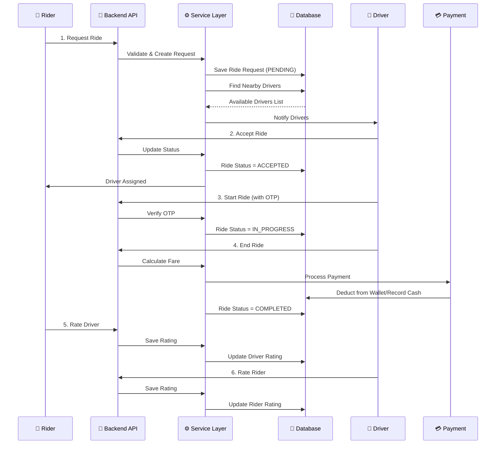
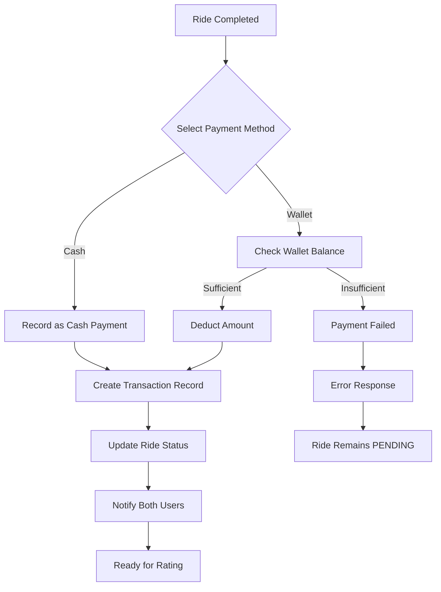
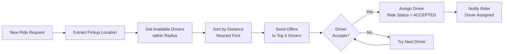
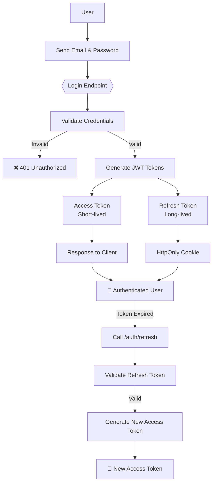

# Uber App - Ride-Sharing Platform Backend

A comprehensive Spring Boot-based backend application for a ride-sharing platform similar to Uber. The system manages riders, drivers, ride requests, payments, and ratings with full authentication and authorization.

## 🎯 System Architecture & Flow

### High-Level System Overview

```
┌─────────────────────────────────────────────────────────────────────────────┐
│                            UBER APP BACKEND                                  │
└─────────────────────────────────────────────────────────────────────────────┘

        ┌──────────────────────┐           ┌──────────────────────┐
        │      RIDER APP       │           │     DRIVER APP       │
        └──────────────────────┘           └──────────────────────┘
                    │                                   │
                    ▼                                   ▼
        ┌──────────────────────┐           ┌──────────────────────┐
        │   Auth Controller    │           │   Auth Controller    │
        │   Rider Controller   │           │   Driver Controller  │
        └──────────────────────┘           └──────────────────────┘
                    │                                   │
                    ▼                                   ▼
        ┌────────────────────────────────────────────────────────┐
        │            Security Layer (JWT + Spring Security)       │
        └────────────────────────────────────────────────────────┘
                            ▼
        ┌────────────────────────────────────────────────────────┐
        │              Service Layer (Business Logic)             │
        │  ┌──────────────┐  ┌──────────────┐  ┌──────────────┐  │
        │  │ Ride Service │  │ Payment Svc  │  │ Rating Svc   │  │
        │  └──────────────┘  └──────────────┘  └──────────────┘  │
        │  ┌──────────────┐  ┌──────────────┐  ┌──────────────┐  │
        │  │Driver Service│  │Wallet Svc    │  │ Email Svc    │  │
        │  └──────────────┘  └──────────────┘  └──────────────┘  │
        └────────────────────────────────────────────────────────┘
                            ▼
        ┌────────────────────────────────────────────────────────┐
        │            Repository Layer (Data Access)              │
        │        Spring Data JPA + Hibernate Spatial             │
        └────────────────────────────────────────────────────────┘
                            ▼
        ┌────────────────────────────────────────────────────────┐
        │         PostgreSQL Database with PostGIS               │
        │     (User, Rider, Driver, Ride, Payment, Wallet)       │
        └────────────────────────────────────────────────────────┘
```

### Ride Request Flow (User Journey)



### Payment Processing Flow



### Driver Matching Strategy



---

## 🚀 Project Overview

This is a production-ready REST API backend built with Spring Boot 3.3.1 that enables:
- User authentication (Riders & Drivers) with JWT tokens
- Real-time ride request management
- Driver matching based on proximity
- Multiple payment strategies (wallet & cash)
- Rating and review system
- Distance calculation using OSRM API
- Email notifications
- Wallet and transaction management

### Authentication Flow



---

## 📋 Tech Stack

| Component | Technology |
|-----------|-----------|
| **Framework** | Spring Boot 3.3.1 |
| **Language** | Java 21 |
| **Database** | PostgreSQL with Hibernate Spatial |
| **Security** | Spring Security + JWT (JJWT 0.12.6) |
| **API Documentation** | SpringDoc OpenAPI (Swagger UI) |
| **Mapping** | ModelMapper 3.2.0 |
| **Build Tool** | Apache Maven |
| **Testing** | JUnit 5 + TestContainers |
| **Utilities** | Lombok |

## 📁 Project Structure

```
uberApp/
├── src/main/java/com/project/uber/uberApp/
│   ├── controllers/          # REST API endpoints
│   │   ├── AuthController
│   │   ├── RiderController
│   │   └── DriverController
│   ├── services/             # Business logic interfaces
│   ├── services/impl/        # Service implementations
│   ├── entities/             # JPA entities and enums
│   ├── repositories/         # Spring Data JPA repositories
│   ├── dto/                  # Data Transfer Objects
│   ├── security/             # JWT and authentication
│   ├── strategies/           # Strategy pattern implementations
│   │   └── impl/
│   │       ├── DriverMatchingNearestDriverStrategy
│   │       ├── WalletPaymentStrategy
│   │       └── CashPaymentStrategy
│   ├── configs/              # Spring configurations
│   ├── exceptions/           # Custom exceptions
│   ├── advices/              # Global exception handlers
│   └── utils/                # Utility classes
├── pom.xml
└── HELP.md
```

## 🔄 Application Flow

### 1. **Authentication Flow**
```
User Registration (Signup)
    ↓
Login with Credentials
    ↓
JWT Token Generated (Access + Refresh)
    ↓
Refresh Token stored in HttpOnly Cookie
    ↓
Token Refresh Endpoint for new Access Tokens
```

### 2. **Ride Request Flow**
```
Rider requests a ride
    ↓
Ride Request created with status: PENDING
    ↓
System searches for nearby drivers
    ↓
Driver accepts ride
    ↓
Driver arrives at pickup location
    ↓
Driver starts ride with OTP
    ↓
Ride IN_PROGRESS
    ↓
Driver ends ride
    ↓
Payment processing (Wallet/Cash)
    ↓
Rider & Driver ratings
    ↓
Ride completed
```

### 3. **Driver Matching Strategy**
- Uses **Nearest Driver Strategy** based on geolocation
- Filters drivers:
  - With status AVAILABLE
  - Sorted by distance (closest first)
  - Using PostGIS spatial queries via Hibernate Spatial

### 4. **Payment Flow**
- **Multiple Payment Strategies**:
  - **Wallet Payment**: Deducts from rider's wallet balance
  - **Cash Payment**: Records payment as pending
- Transaction logging for audit trail
- Payment status tracking (PENDING, COMPLETED, FAILED)

## 📚 API Endpoints

### Authentication (`/auth`)
| Method | Endpoint | Description | Auth |
|--------|----------|-------------|------|
| POST | `/signup` | User registration | ❌ |
| POST | `/login` | User login | ❌ |
| POST | `/refresh` | Refresh JWT token | ✅ |
| POST | `/onBoardNewDriver/{userId}` | Onboard driver | ✅ ADMIN |

### Rider Endpoints (`/riders`)
| Method | Endpoint | Description | Auth |
|--------|----------|-------------|------|
| POST | `/requestRide` | Request a new ride | ✅ RIDER |
| GET | `/getMyRides` | Get ride history (paginated) | ✅ RIDER |
| POST | `/cancelRide/{rideId}` | Cancel requested/ongoing ride | ✅ RIDER |
| POST | `/rateDriver` | Rate completed ride driver | ✅ RIDER |
| GET | `/getMyProfile` | Get rider profile | ✅ RIDER |

### Driver Endpoints (`/drivers`)
| Method | Endpoint | Description | Auth |
|--------|----------|-------------|------|
| POST | `/acceptRide/{rideRequestId}` | Accept ride request | ✅ DRIVER |
| POST | `/startRide/{rideRequestId}` | Start ride with OTP | ✅ DRIVER |
| POST | `/endRide/{rideId}` | Complete ride | ✅ DRIVER |
| POST | `/cancelRide/{rideId}` | Cancel ride | ✅ DRIVER |
| POST | `/rateRider` | Rate completed ride rider | ✅ DRIVER |
| GET | `/getMyProfile` | Get driver profile | ✅ DRIVER |
| GET | `/getMyRides` | Get ride history (paginated) | ✅ DRIVER |

## 🔐 Security

### Authentication
- **JWT-based Authentication** with JJWT library
- Access tokens (short-lived) for API requests
- Refresh tokens (long-lived) stored in HttpOnly cookies
- Stateless authentication

### Authorization
- **Role-based Access Control** using Spring Security
- Roles: `ROLE_RIDER`, `ROLE_DRIVER`, `ROLE_ADMIN`
- Method-level security with `@Secured` annotations

### Password Security
- BCrypt encryption for password hashing

## 💾 Core Entities

### User
- Email, password, first/last name
- Role (RIDER/DRIVER/ADMIN)
- Account creation tracking

### Rider
- Extends User
- Wallet reference
- Profile ratings

### Driver
- Extends User
- Vehicle information
- Current location (latitude/longitude)
- Availability status
- Rating and review system

### Ride
- Pickup & dropoff locations
- Passenger & driver assignment
- Ride status (REQUESTED, ACCEPTED, IN_PROGRESS, COMPLETED, CANCELLED)
- Payment method & amount
- OTP verification

### Payment
- Multiple payment strategies
- Transaction history
- Status tracking

### Wallet
- Rider balance management
- Transaction history
- Linked transactions

## 🛠️ Setup & Installation

### Prerequisites
- Java 21 JDK
- Maven 3.8+
- PostgreSQL 12+
- OSRM (Open Source Routing Machine) service running

### Environment Configuration

Create `application.properties` with:
```properties
spring.datasource.url=jdbc:postgresql://localhost:5432/uber_db
spring.datasource.username=postgres
spring.datasource.password=your_password
spring.datasource.driver-class-name=org.postgresql.Driver

spring.jpa.hibernate.ddl-auto=update
spring.jpa.properties.hibernate.dialect=org.hibernate.spatial.dialect.postgresql.PostGISDialect

jwt.secret=your_jwt_secret_key
jwt.expiration=3600000
jwt.refreshExpiration=604800000

mail.from=your_email@gmail.com
mail.password=your_app_password

osrm.service.url=http://localhost:5000
```

### Build & Run

```bash
# Clone the repository
git clone https://github.com/theadityadongre/uber.git
cd uberApp

# Build the project
mvn clean install

# Run the application
mvn spring-boot:run

# The server will start on http://localhost:8080
```

### API Documentation
Once running, access Swagger UI at: **http://localhost:8080/swagger-ui.html**

## 🧪 Testing

The project includes integration tests using TestContainers for PostgreSQL:

```bash
# Run all tests
mvn test

# Run specific test class
mvn test -Dtest=YourTestClass
```

## 📊 Database Schema Highlights

- **Spatial Queries**: Uses PostGIS for geographic distance calculations
- **Relationships**: 
  - One-to-Many between User and Ride
  - One-to-One between Rider and Wallet
  - Many-to-Many between Driver and Rating
- **Indexes**: Optimized for ride status queries and driver location lookups

## 🎯 Key Features Implemented

✅ User registration and authentication  
✅ JWT token management with refresh capability  
✅ Ride request creation and matching  
✅ Real-time driver availability tracking  
✅ Multiple payment processing strategies  
✅ OTP-based ride start verification  
✅ Rating and review system  
✅ Email notifications  
✅ Wallet management and transactions  
✅ Pagination for ride history  
✅ Global exception handling  
✅ API documentation with Swagger  

## 🔮 Future Enhancements

- Real-time notifications (WebSocket/Kafka)
- Ride tracking with live location updates
- Advanced search filters (car type, driver rating, etc.)
- Promo codes and discounts
- Driver analytics dashboard
- Admin panel for system management
- SMS notifications
- Multiple language support

## 📄 API Response Format

### Success Response
```json
{
  "status": 200,
  "message": "Success",
  "data": { ... }
}
```

### Error Response
```json
{
  "status": 400,
  "message": "Error description",
  "error": "ErrorCode"
}
```

## 📞 Support & Contribution

For issues, feature requests, or contributions, please open an issue or pull request on GitHub.

## 📜 License

This project is part of the learning initiative for building scalable ride-sharing systems.

---

**Built with ❤️ using Spring Boot**

**Repository**: [theadityadongre/uber](https://github.com/theadityadongre/uber)
